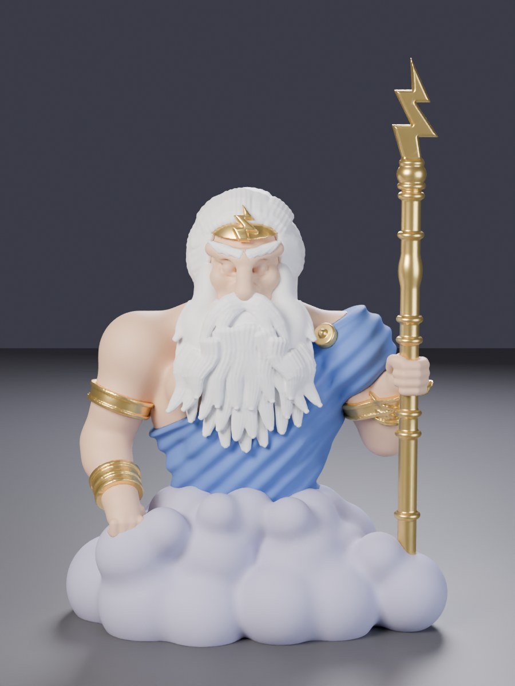
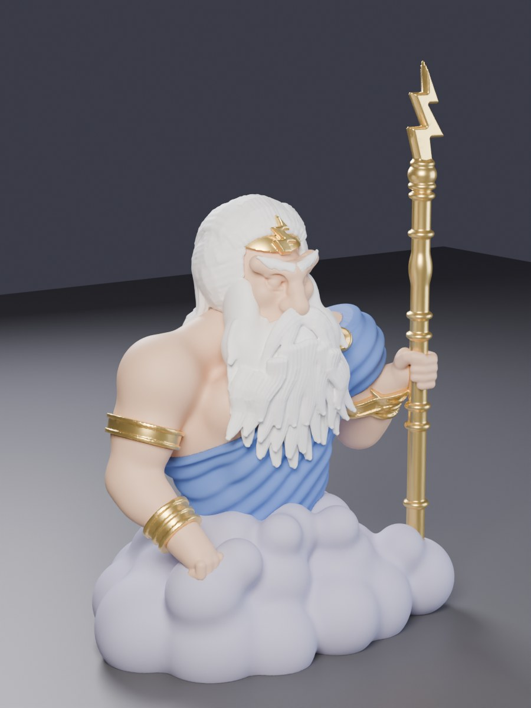
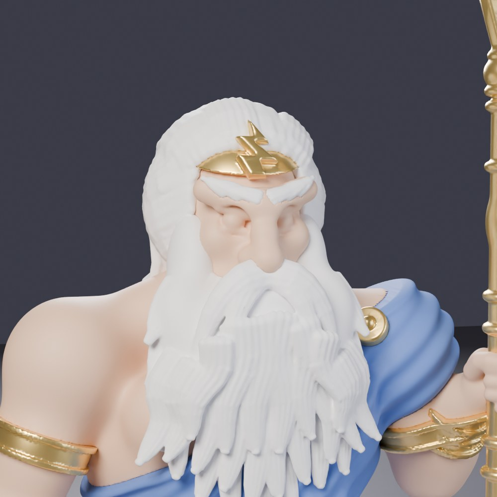
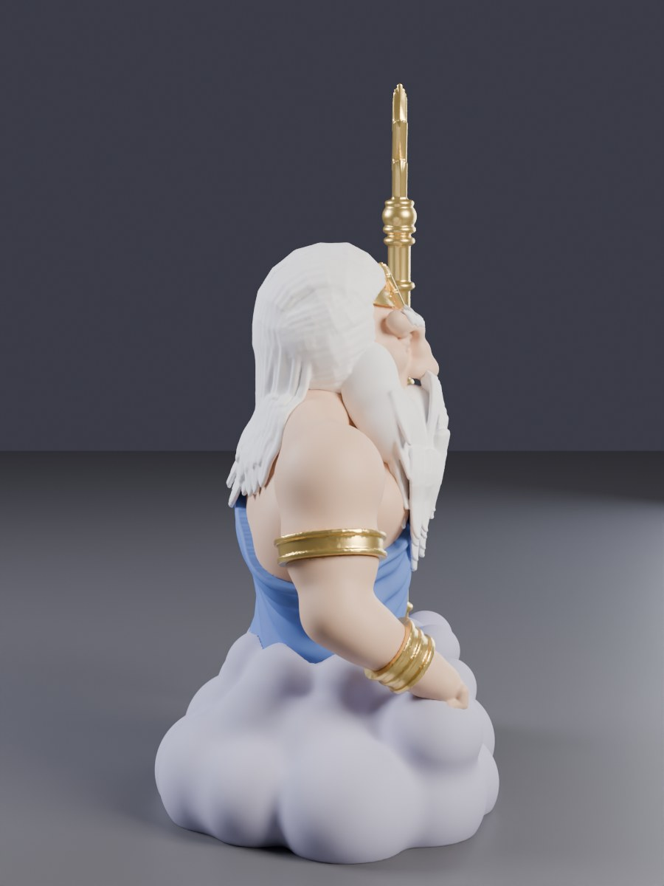
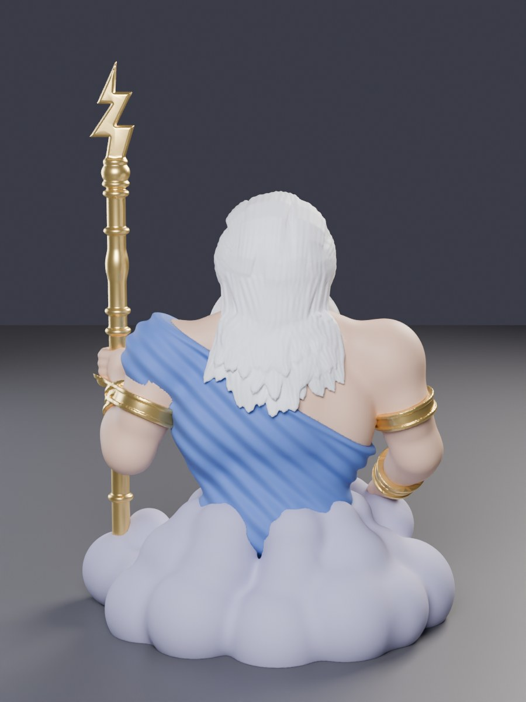
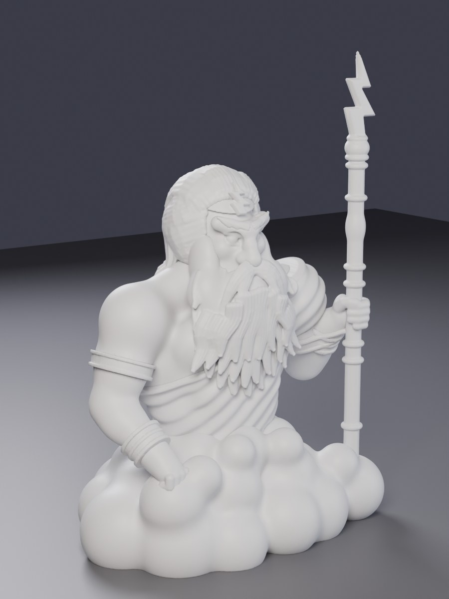

# Storm Lord – 3D printable figure

An unofficial fan sculpt of the **Storm Lord** from *Wizard101*: a titan rising
out of a storm cloud, with a wild white mane and beard, a gold circlet with a
lightning-bolt emblem, a blue one-shoulder toga, gold arm bands, and a lightning
staff in his left hand.

| Front | Three-quarter | Face |
|---|---|---|
|  |  |  |

| Side | Back | Single colour |
|---|---|---|
|  |  |  |

## Files

| File | Use |
|---|---|
| `stl/storm_lord_single_color.stl` | The whole figure as one watertight solid, for printing in one filament |
| `stl/multicolor/1_cloud.stl` … `5_gold.stl` | Five colour parts that fit together exactly (no gaps or overlaps), for AMS printing |

* **Size at 100 %:** 122 × 86 × 178 mm (W × D × H). It sits on a flat
  6,700 mm² cloud base, so it is stable and needs no brim.
* **Units:** millimetres, Z up, already sitting on the bed. Don't rotate it.
* **Bambu Lab X2D:** the build volume is 256 × 256 × 260 mm, so the figure fits
  at 100 % and can be scaled up to about **145 %** (≈ 258 mm tall). Larger
  prints show more face and hair detail.

## Printing on the Bambu Lab X2D

### Multicolour (AMS)

1. In Bambu Studio, select **all five files** in `stl/multicolor/` and drag them
   in together.
2. When it asks *"Load these files as a single object with multiple parts?"*,
   click **Yes**. The parts snap together in the right place.
3. In the object list, give each part a filament:

   | Part | Suggested filament |
   |---|---|
   | `1_cloud` | lavender or light grey |
   | `2_toga` | royal blue |
   | `3_skin` | tan or skin tone |
   | `4_hair` | white |
   | `5_gold` | gold or silk gold |

4. To cut purge waste, turn on **Flush into objects' infill** for the parts.

### Single colour

Load `stl/storm_lord_single_color.stl`. White or silk gold PLA looks great, or
use grey and paint it.

### Suggested settings (PLA, 0.4 mm nozzle)

* **Layer height:** 0.12 mm for the best face and hair, or 0.16 mm for speed
* **Supports:** on, **Tree (auto)**, threshold angle about 30°. Supports are
  needed under the beard tips, the arms, and the lightning bolt.
* **Support interface:** the X2D's second nozzle can print the support
  interface in a breakaway support filament for a cleaner underside. This is
  optional.
* **Walls:** 3. **Infill:** 10–15 % gyroid.
* **Brim:** not needed.
* The staff is 6 mm thick and is held by the hand and the cloud. Print it at
  moderate speed so the top doesn't wobble, or scale the figure up.

## How it was made

The figure is a procedural "digital sculpt". Every body part, fold of the
toga and puff of cloud is a signed-distance-field shape, and the shapes are
blended smoothly together (`sdf.py`, `storm_lord.py`). The hair and beard are
built from about 130 flat, combed locks with fine carved strand grooves. Wavy
locks sweep back over the crown, and the side hair is combed back over the
ears. At the back the hair falls onto the upper back in a three-tier cascade of
overlapping, tapered locks, styled like the beard's moustache, cheek and chest
rows. It all lies close to the body, so it reads as thick, luscious hair rather
than spikes. Marching cubes
then turns the fields into meshes at 0.3 mm resolution, so every mesh is
guaranteed watertight and manifold. Each colour is carved out of the others in
priority order (gold → hair → toga → skin → cloud), which is why the parts fit
together exactly. Blender then decimates the meshes and exports the STLs
(`export_print.py`) and renders the previews (`render_preview.py`).

To rebuild or tweak it (Python 3.11 with `pip install bpy numpy scipy
scikit-image trimesh`):

```bash
python3 storm_lord.py 0.3 build          # sculpt -> build/part_*.ply + whole.ply (~2 min)
python3 export_print.py build stl 0.3    # Blender: decimate + export stl/ (add --blend for a .blend)
python3 render_preview.py stl previews   # Blender Cycles preview renders (PNG)
```

Useful knobs in `storm_lord.py`: `HS` sets the head size, `ARM` holds the arm
pose, `STAFF_R` sets the staff thickness, and the lists in `build_hair` and
`build_beard` hold the individual locks.

---

*Storm Lord and Wizard101 are © KingsIsle Entertainment. This is an
unofficial, non-commercial fan model for personal use.*
